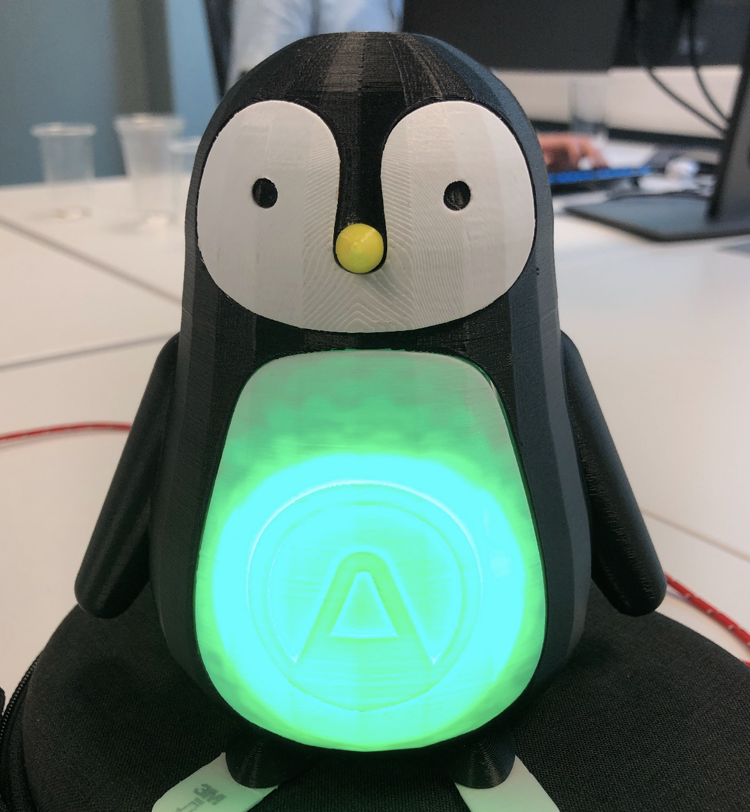
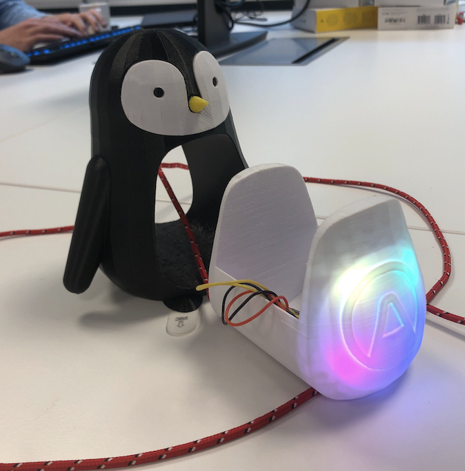
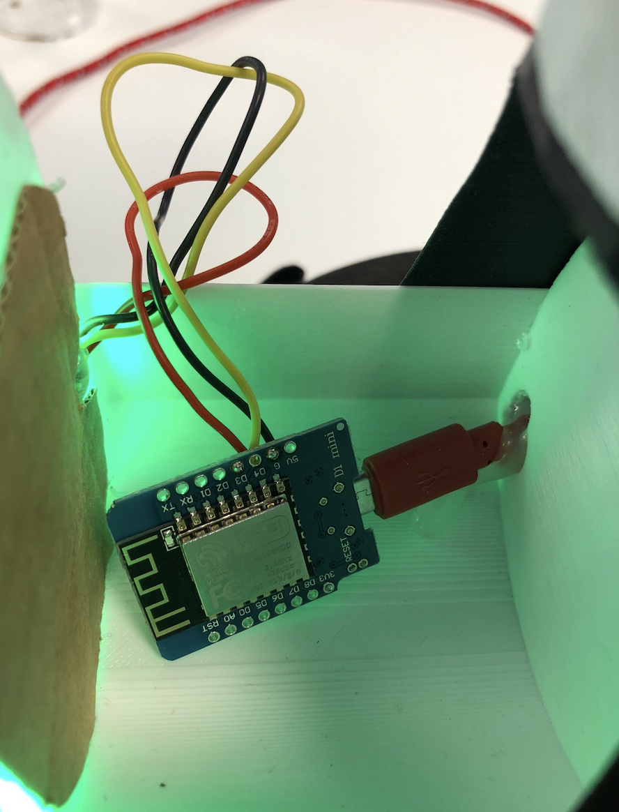
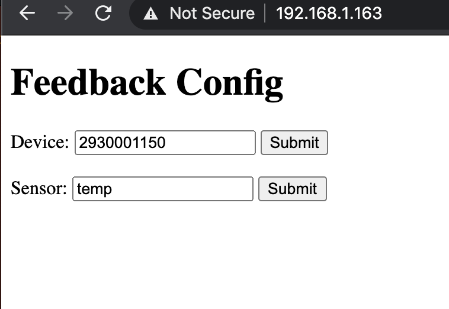

# airthings-extreme-feedback

This is an example project for how one can easily make an visual feedback device for the indoor air quality.

The device electronics consist of an esp-8266 and a neopixel light ring.
Inside a 3D printend animal (for dramatic effect).

This code does:
- Authorize the device with the Airthings API using a Client Credentials Grant.
- Poll the API for new values (of the device and sensor configured).
- Visualize the resulting values as LED illumination in different colors.
- Configuration of the device on it's own configuration page (deviceId and serialNumber).

